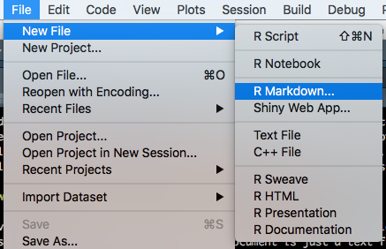
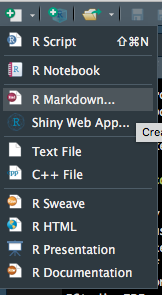

```{r setup, include=FALSE}
knitr::opts_chunk$set(echo = TRUE, eval = FALSE)
```


\newpage

## Course Outline

### Abstract

Branded reports give a clean, clear and consistent message for data science teams in an organization. We walk through the process of building a latex template distributed through an R package. We begin with a short introduction to rmarkdown and some motivating examples for using branded reports. Then, we demonstrate from scratch how one can build a minimal latex template, and distribute in a R package. We describe some best practices for branding and highlight use of ggplot2 themes to match document branding. Finally, we walk through some further uses such as parameterized reports, using the template for bookdown, and recommendation for deploying the R package at your company.

### Learning Objectives

The student should be able to walk away from this class with:

1. a general understanding of rmarkdown,
2. why it is important to have branded reports,
3. a R package with a latex template that uses their companies branding,
4. understanding of best practices in branding,
5. use of ggplot2 themes,
6. and some possible further uses for the using and distributing the template.

### About the Instructor

Ben Barnard is a Data Scientist at Wells Fargo in the Team Member Insights group. Ben has a PhD from Baylor University in Statistics.

Jeff Idle is an Analytic Manager at Wells Fargo in the Team Member Insights group. Jeff leads the HR Advanced Analytics & Architecture team. Jeff is currently pursuing a MBA from the University of Minnesota's Carlson School of Management.


### Relevance to Conference Goals

We stress using branded reports to communicate clean, clear and consistent messages to your audience. Communication is the most important part of Data Science since decision makers are rarely analytic experts. Branded reports bring a certain professionalism that will be greatly appreciated by administration. Building the latex templates saves time and makes sure every report comes out looking the same. Consistently branded reports allows your team to be recognized immediately by your work product.

\newpage

## Getting Started


\newpage

## Introduction to R Markdown - 45 mins

We discuss the R Markdown document format developed by [RStudio](https://rstudio.com/). [R Markdown](https://rmarkdown.rstudio.com/) is a document format, and [`rmarkdown`](https://rmarkdown.rstudio.com/docs/) is an R package. There can be confusion when talking about the two, and in this course we are usually talking about the R Markdown document format. Most of this portion of the class uses references from the Rstudio R Markdown website, the `rmarkdown` package website and the [R Markdown book](https://bookdown.org/yihui/rmarkdown/). We will walk through creating an R Markdown document that we will use for the initial template of our branded document.

### What is R Markdown

R Markdown is a document format built to embed R code chunks in Markdown documents. R Markdown documents remove most of the formating aspects of report generation to a "backend." R Markdown can be used to generate many different output some of which are websites, pdfs, presentations, shiny, and Word documents. In this course we are going to focus on pdf documents, but in general the same R Markdown document can be used to produce all of the above with minimal changes.

### Why should I use R Markdown

R markdown provides a medium to attach and run code inside the content for dashboards, articles, reports, websites, powerpoints and books. This medium provides a reproducible and portable format that works with text based version control systems. These characteristics generally make R markdown documents easy to put into production systems 

### How to start an R Markdown document

As previously mentioned R markdown plays well with text based version control systems, and that is because at its core an R markdown document is just a text file. R markdown files have .rmd extensions but you could potentially render any text file no matter the extension. If you expect the RStudio IDE to recognize an R markdown document it needs the .rmd extension. Let us take the easy route and create an R markdown document from the RStudio IDE menu.






### Structure of an R Markdown document

```{yaml}
---
title: "Untitled"
author: "Name"
date: "Date"
output: pdf_document
---
```

````markdown
`r ''````{r}
1 + 1
```
````


### Rendering R Markdown documents

### PDF documents

### Engines

## Introduction to R packages - 35 mins

### What is an R package

### Why should I build R packages

### How to build your first R package

### Ways to distribute R packages

## Introduction to LaTex - 60 mins

### What is LaTex

### Why should I use LaTex

### How to start your first LaTex document

## Bringing It all together - 30 mins

## Possible extensions - 35 mins

